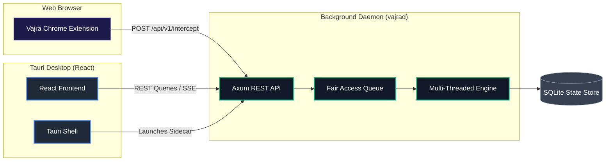

# Developer & Contributor Guide

Welcome to the internal development guide for **Vajra Download Manager**. This document contains everything you need to know about the architecture, how to build the project from source, and how to use the developer convenience scripts.

---

## 🏗️ Architecture

Vajra employs a decoupled architecture separating the high-speed Rust engine from the React/Tauri frontend.



### 📦 Workspace Structure

Vajra is organized as a modular Rust Cargo workspace:

- **`vajra-engine`**: High-performance multi-threaded core (throttling, multiplexing, sparse allocation, mmap).
- **`vajra-daemon`**: Axum-based server managing queue schedules, RSS feeds, WebDAV files, and webhook integrations.
- **`vajra-protocol`**: Unified serialization protocols and type mappings shared between clients and daemon.
- **`vajra-cli`**: Clap-based CLI client with full IDM command parameter mapping.
- **`vajra-ui-tauri`**: React-based desktop control center wrapping the daemon sidecar.
- **`vajra-extension`**: Chrome Manifest V3 sniffer extension.
- **`vajra-mobile`**: React Native (Expo) companion application.

---

## 🚀 Development Setup

### Prerequisites

- [Rust stable](https://rustup.rs) (1.75+)
- [Node.js 20+](https://nodejs.org)
- [VS Build Tools 2022](https://visualstudio.microsoft.com/downloads/#build-tools-for-visual-studio-2022) (Windows only, with "Desktop development with C++")

---

## 🛠️ Building the Project

### Using Automation Scripts (Windows)

For developers on Windows, we've provided bat scripts for a one-click setup.

**1. Full Build:**
Run the root build script to compile the backend crates and frontend targets automatically. This creates the production binaries.
```bat
build-all.bat
```

**2. Development Mode:**
To launch the desktop application in a hot-reloading development environment:
```bat
dev.bat
```

### Manual Build Steps (Cross-Platform)

If you are not on Windows or prefer building manually:

**1. Build the Rust backend & CLI:**
```bash
cargo build --workspace --release
```

**2. Build the Tauri Frontend:**
```bash
cd vajra-ui-tauri
npm install
npm run build
# Or to run the Tauri dev server:
npm run tauri dev
```

**3. Build the Browser Extension:**
```bash
cd vajra-extension
npm install
npm run build
```

---

## 🧪 Testing & Quality

Before submitting PRs, ensure all quality checks pass.

**Run Rust tests:**
```bash
cargo test --workspace
```

**Run Rust linters:**
```bash
cargo fmt
cargo clippy -- -D warnings
cargo deny check
```

**Run Node.js linters:**
```bash
cd vajra-ui-tauri
npm run lint
npm run format:check
```
