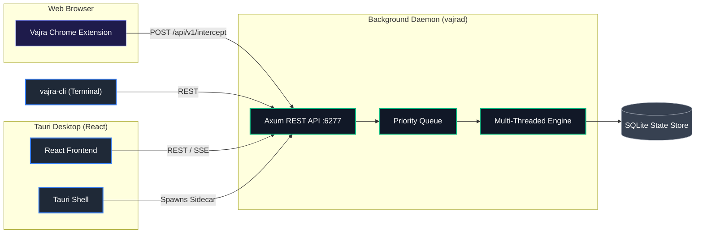

# 🛠️ Developer & Contributor Guide

This document is the complete reference for building Vajra from source, understanding its internal architecture, running tests, and contributing code.

> **Looking to install Vajra as a user?** See the [main README](README.md) instead.

---

## 📋 Table of Contents

- [Architecture Overview](#-architecture-overview)
- [Workspace Structure](#-workspace-structure)
- [Prerequisites](#-prerequisites)
  - [Windows](#-windows)
  - [macOS](#-macos)
  - [Linux](#-linux)
- [Building from Source](#-building-from-source)
  - [1. Clone the Repository](#1-clone-the-repository)
  - [2. Build the Rust Backend](#2-build-the-rust-backend)
  - [3. Build the Desktop UI](#3-build-the-desktop-ui)
  - [4. Build the Browser Extension](#4-build-the-browser-extension)
- [Running in Development Mode](#-running-in-development-mode)
- [Testing & Code Quality](#-testing--code-quality)
- [Windows Convenience Scripts](#-windows-convenience-scripts)
- [Contributing](#-contributing)

---

## 🏗️ Architecture Overview

Vajra employs a decoupled, daemon-first architecture. All business logic lives inside the background Rust daemon (`vajrad`). The UI, CLI, and browser extension are merely thin clients that communicate with it over a local REST API.



---

## 📦 Workspace Structure

Vajra is organized as a modular Rust Cargo workspace with a separate Node.js project for each frontend:

| Crate / Directory | Language | Description |
|:---|:---|:---|
| `vajra-engine` | Rust | High-performance download core: parallel multiplexing, connection stealing, OS-level pre-allocation, zero-copy mmap writes |
| `vajra-daemon` | Rust | Axum HTTP server hosting the REST API, task queue, scheduler, RSS poller, WebDAV, and webhook integrations |
| `vajra-protocol` | Rust | Shared types and serialization schemas used by all clients |
| `vajra-cli` | Rust | Full-featured terminal CLI built with Clap |
| `vajra-ui-tauri` | Rust + TypeScript (React + Vite) | Desktop application built with Tauri v2 |
| `vajra-extension` | TypeScript (Chrome MV3) | Browser extension for intercepting downloads |
| `vajra-mobile` | TypeScript (React Native / Expo) | Mobile companion app |

---

## ✅ Prerequisites

### 🪟 Windows

1. **Rust Toolchain**
   Install from [rustup.rs](https://rustup.rs). Use the `x86_64-pc-windows-msvc` target.
   ```powershell
   winget install Rustlang.Rustup
   # Or download from: https://rustup.rs
   rustup default stable
   ```

2. **Visual Studio Build Tools 2022**
   Required for compiling Rust crates that use native C libraries.
   - Download: [VS Build Tools](https://visualstudio.microsoft.com/downloads/#build-tools-for-visual-studio-2022)
   - Select: **"Desktop development with C++"** workload
   - Alternative: Install the full Visual Studio 2022 (Community is free).

3. **Node.js 22+**
   ```powershell
   winget install OpenJS.NodeJS
   # Or download from: https://nodejs.org
   ```
   Verify: `node --version` and `npm --version`

4. **WebView2 Runtime** (usually pre-installed on Windows 11)
   Required by Tauri. If missing, download from [Microsoft](https://developer.microsoft.com/en-us/microsoft-edge/webview2/).

---

### 🍎 macOS

1. **Xcode Command Line Tools**
   ```bash
   xcode-select --install
   ```

2. **Rust Toolchain**
   ```bash
   curl --proto '=https' --tlsv1.2 -sSf https://sh.rustup.rs | sh
   rustup default stable
   ```
   For Apple Silicon (M1/M2/M3), also add the Intel target if you want to build universal binaries:
   ```bash
   rustup target add x86_64-apple-darwin aarch64-apple-darwin
   ```

3. **Node.js 22+**
   ```bash
   # Using Homebrew (recommended)
   brew install node
   # Or from https://nodejs.org
   ```

---

### 🐧 Linux (Debian / Ubuntu)

1. **System Dependencies**
   ```bash
   sudo apt-get update
   sudo apt-get install -y \
     build-essential \
     libwebkit2gtk-4.1-dev \
     libappindicator3-dev \
     librsvg2-dev \
     patchelf \
     curl \
     wget \
     file \
     libssl-dev \
     libgtk-3-dev
   ```

2. **Rust Toolchain**
   ```bash
   curl --proto '=https' --tlsv1.2 -sSf https://sh.rustup.rs | sh
   source ~/.cargo/env
   rustup default stable
   ```

3. **Node.js 22+**
   ```bash
   # Using NodeSource repository
   curl -fsSL https://deb.nodesource.com/setup_22.x | sudo -E bash -
   sudo apt-get install -y nodejs
   ```

---

## 🔨 Building from Source

### 1. Clone the Repository

```bash
git clone https://github.com/msmayanksingh22/Vajra-Download-Manager.git
cd Vajra-Download-Manager
```

---

### 2. Build the Rust Backend

This compiles both the `vajrad` background daemon and the `vajra-cli` command-line tool.

**Debug build** (faster compilation, larger binary):
```bash
cargo build --workspace
```

**Release build** (optimized for production, slower to compile):
```bash
cargo build --workspace --release
```

Binaries will be at:
- `target/release/vajrad` (or `vajrad.exe` on Windows)
- `target/release/vajra-cli` (or `vajra-cli.exe` on Windows)

---

### 3. Build the Desktop UI (Tauri)

The Tauri app bundles the React frontend and the Rust backend into one installer.

**Step 1:** Install the Tauri CLI globally (only needed once):
```bash
npm install -g @tauri-apps/cli
```

**Step 2:** Install frontend dependencies:
```bash
cd vajra-ui-tauri
npm install
```

**Step 3a:** Run in development mode (live-reloading):
```bash
npm run tauri dev
```

**Step 3b:** Build the production installer:
```bash
npm run tauri build
```

Output installers will be at:
- **Windows:** `vajra-ui-tauri/src-tauri/target/release/bundle/nsis/*.exe`
- **macOS:** `vajra-ui-tauri/src-tauri/target/release/bundle/dmg/*.dmg`
- **Linux:** `vajra-ui-tauri/src-tauri/target/release/bundle/deb/*.deb` and `*.AppImage`

---

### 4. Build the Browser Extension

```bash
cd vajra-extension
npm install
npm run build
```

The built extension will be in `vajra-extension/dist/`. Load this folder as an unpacked extension in Chrome/Edge.

---

## ⚡ Running in Development Mode

To work on the desktop app with hot-reloading:

```bash
# Terminal 1: Start the daemon independently (optional — Tauri will start it too)
cargo run -p vajra-daemon

# Terminal 2: Start the Tauri dev server
cd vajra-ui-tauri
npm run tauri dev
```

The daemon listens on `http://127.0.0.1:6277` by default. You can override the port with the `VAJRA_PORT` environment variable.

---

## 🧪 Testing & Code Quality

Before submitting a Pull Request, all checks must pass.

**Run all Rust unit tests:**
```bash
cargo test --workspace
```

**Check code formatting:**
```bash
cargo fmt --all -- --check
```

**Auto-fix formatting:**
```bash
cargo fmt --all
```

**Run the Clippy linter (strict mode):**
```bash
cargo clippy --workspace --all-targets --all-features -- -D warnings
```

**Check supply chain security (licenses & advisories):**
```bash
cargo deny check
```

**Run frontend type-checking and linting:**
```bash
cd vajra-ui-tauri
npm run lint
npx tsc --noEmit
```

---

## 🪟 Windows Convenience Scripts

The following scripts in the `scripts/` directory are included for developer convenience on Windows:

| Script | Purpose |
|:---|:---|
| `scripts/build-daemon.bat` | Build only the Rust daemon in release mode |
| `scripts/build-release.bat` | Full release build of all components |
| `scripts/run-daemon.bat` | Start the daemon directly for testing |
| `scripts/run-tauri.bat` | Launch the Tauri dev environment |
| `scripts/setup-build-env.ps1` | One-click setup for Windows build prerequisites |

And at the repo root:
| Script | Purpose |
|:---|:---|
| `build-all.bat` | Build everything (daemon + CLI + UI) in one shot |
| `dev.bat` | Launch the full development environment |

---

## 🤝 Contributing

We welcome contributions of all sizes!

1. **Fork** the repository.
2. **Create a feature branch**: `git checkout -b feat/my-feature`
3. **Make your changes** and ensure all tests pass (see above).
4. **Commit** using [Conventional Commits](https://www.conventionalcommits.org/): `git commit -m "feat: add my feature"`
5. **Push** to your fork and **open a Pull Request** against `main`.

For more details on the PR process and coding standards, see [CONTRIBUTING.md](CONTRIBUTING.md).
