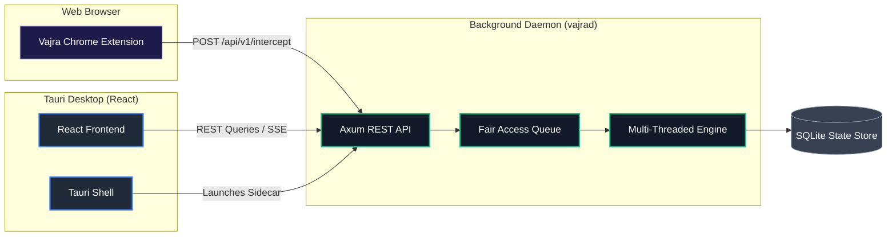

<div align="center">
  

  <h1>Vajra Download Manager</h1>
  <p><strong>The high-performance, developer-first download manager.<br>Headless-capable, API-driven, and built with Rust + Tauri.</strong></p>

  <p>
    <a href="https://github.com/msmayanksingh22/Vajra-Download-Manager/actions/workflows/build.yml">
      
    </a>
    <a href="https://github.com/msmayanksingh22/Vajra-Download-Manager/blob/main/LICENSE">
      
    </a>
    <a href="https://rustup.rs">
      
    </a>
    <a href="https://tauri.app">
      
    </a>
  </p>
</div>

<br />

Welcome to **Vajra**, a next-generation download manager engineered for ultimate speed, system efficiency, and developer extensibility. 

Whether you need a blazing-fast UI for your daily downloads or a headless daemon to integrate into your backend services, Vajra delivers.

---

## ✨ Key Features

| Feature | Description |
| :--- | :--- |
| **⚡ Parallel Multiplexing** | Splits files into byte-range segments using concurrent HTTP requests, achieving speeds up to **10x faster** than standard browser downloaders. |
| **🧠 Connection Stealing** | Dynamically reassigns idle connection threads to assist the slowest active segment, ensuring zero idle workers. |
| **💾 OS-Level Pre-allocation** | Bypasses zero-filling by using native OS APIs (`SetEndOfFile`, `fallocate`, `fcntl`) to pre-allocate file structures instantly. |
| **🚀 Zero-Copy Memory Mapping** | Leverages memory-mapped file handles to write network packages directly to disk positions, bypassing traditional user-space buffering. |
| **🔒 Integrated VPN Kill Switch** | Continuously monitors system interfaces and automatically pauses active downloads if your VPN connection drops. |
| **🌐 Smart Browser Interception** | Integrated Chrome/Edge Manifest V3 extension intercepts native downloads, sniffs media streams, and captures batches. |

---

## 🏗️ Architecture

Vajra employs a decoupled architecture separating the high-speed Rust engine from the React/Tauri frontend.



---

## 📦 Workspace Structure

Vajra is organized as a modular Rust Cargo workspace:

- **`vajra-engine`**: High-performance multi-threaded core (throttling, multiplexing, sparse allocation, mmap).
- **`vajra-daemon`**: Axum-based server managing queue schedules, RSS feeds, WebDAV files, and webhook integrations.
- **`vajra-protocol`**: Unified serialization protocols and type mappings shared between clients and daemon.
- **`vajra-cli`**: Clap-based CLI client with full IDM command parameter mapping.
- **`vajra-ui-tauri`**: React-based desktop control center wrapping the daemon sidecar.
- **`vajra-extension`**: Chrome Manifest V3 sniffer extension.
- **`vajra-mobile`**: React Native (Expo) companion application.

---

## 🚀 Getting Started

### Prerequisites

- [Rust stable](https://rustup.rs) (1.75+)
- [Node.js 18+](https://nodejs.org)
- [VS Build Tools 2022](https://visualstudio.microsoft.com/downloads/#build-tools-for-visual-studio-2022) (Windows only, with "Desktop development with C++")

### Build & Launch

Run the root build script to compile the backend crates and frontend targets automatically:

```bat
build-all.bat
```

To launch the desktop application:

```bat
vajra.bat
```

> **Note:** The desktop app starts the background daemon automatically. If you close the main window, the application will minimize to the system tray.

### Browser Extension Setup

1. Open `chrome://extensions` in Chrome/Edge.
2. Enable **Developer Mode**.
3. Click **Load unpacked** and select the `vajra-extension/` directory. *(For production, load the `dist/` directory after running `npm run build` inside the extension folder).*
4. Click the extension icon and select **Launch Vajra** if the daemon is offline.

---

## 🔌 API Reference

Vajra's headless capabilities are powered by a REST API accessible at `http://127.0.0.1:6277/api/v1`:

- `GET /health` — Daemon health check
- `GET /downloads` — List all active and completed downloads
- `POST /downloads` — Submit a new download task
- `PATCH /downloads/:id` — Control task state (pause/resume/cancel)
- `GET /stats` — Live global queue throughput and speed statistics
- `GET /events` — Real-time progress updates via Server-Sent Events (SSE)

---

## 🤝 Contributing

We welcome contributions of all sizes! Check out our [Contributing Guide](CONTRIBUTING.md) to get started with the development workflow, coding standards, and PR process.

---

## 🛡️ License & Security

- **License:** Vajra is open source and available under the [GPL-3.0 License](LICENSE).
- **Security:** Please review our [Security Policy](SECURITY.md) to report vulnerabilities privately.
