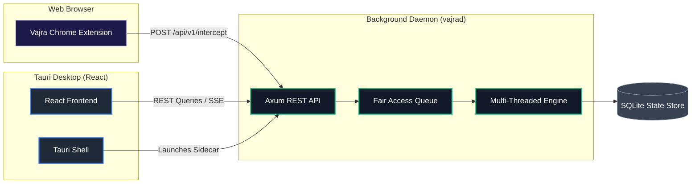

<p align="center">
  
</p>

<p align="center">
  <strong>The high-performance, developer-first download manager. Headless-capable, API-driven, and built in Rust + React.</strong>
</p>

<p align="center">
  <a href="https://github.com/msmayanksingh22/Vajra-Download-Manager/actions/workflows/build.yml">
    
  </a>
  <a href="https://github.com/msmayanksingh22/Vajra-Download-Manager/blob/main/LICENSE">
    
  </a>
  <a href="https://rustup.rs">
    
  </a>
  <a href="https://tauri.app">
    
  </a>
</p>

---

## ✨ Features

### ⚡ Parallel Download Multiplexing
Vajra splits files into byte-range segments using concurrent HTTP requests, achieving download speeds up to **10x faster** than standard browser downloaders.

### 🧠 Connection Stealing
If a connection thread finishes its segment early, the multiplexer dynamically splits the remaining portion of the slowest active segment and reassigns it, ensuring zero idle workers.

### 💾 OS-Level Pre-allocation
Saves write operations and avoids disk fragmentation using native OS APIs to pre-allocate file structures instantly:
*   **Windows**: NTFS `SetEndOfFile` + `SetFileValidData` (bypasses zero-filling).
*   **Linux**: `fallocate(2)`.
*   **macOS**: `F_PREALLOCATE` `fcntl` + `ftruncate`.

### 🚀 Zero-Copy Memory Mapping
Leverages memory-mapped file handles (`mmap` / `CreateFileMappingW`) to map download files into virtual memory. Network packages are written directly to disk positions, bypassing traditional user-space buffering.

### 🔒 Integrated VPN Kill Switch
Protects your identity. The daemon continuously monitors system interfaces; if your VPN connection drops, active downloads are immediately paused.

### 🌐 Smart Browser Interception & Batch Capture
Integrated Chrome/Edge Manifest V3 extension intercepts native browser downloads, sniffs HLS/DASH media streams, and triggers a batch capture overlay by holding the `Alt` key.

---

## 🏗️ Architecture



---

## 📦 Workspace Structure

Vajra is organized as a modular Rust Cargo workspace:

*   **`vajra-engine`**: High-performance multi-threaded core (throttling, multiplexing, sparse allocation, mmap).
*   **`vajra-daemon`**: Axum-based server managing queue schedules, RSS feeds, WebDAV files, and webhook integrations.
*   **`vajra-protocol`**: Unified serialization protocols and type mappings shared between clients and daemon.
*   **`vajra-cli`**: Clap-based CLI client with full IDM command parameter mapping.
*   **`vajra-ui-tauri`**: React-based desktop control center wrapping the daemon sidecar.
*   **`vajra-extension`**: Chrome Manifest V3 sniffer extension.
*   **`vajra-mobile`**: React Native (Expo) companion application.

---

## 🚀 Getting Started

### Prerequisites

*   [Rust stable](https://rustup.rs)
*   [Node.js 18+](https://nodejs.org)
*   [VS Build Tools 2022](https://visualstudio.microsoft.com/downloads/#build-tools-for-visual-studio-2022) (with "Desktop development with C++" workload)

### Build the Workspace

Run the root build script to compile the backend crates and frontend targets automatically:

```bat
build-all.bat
```

### Launching Vajra

```bat
vajra.bat
```

The desktop app will launch and start the background daemon automatically. If you close the main window, the application continues to run in the Windows system tray.

### Browser Extension Setup

1. Open `chrome://extensions` in Chrome/Edge.
2. Enable **Developer Mode**.
3. Click **Load unpacked** and select the `vajra-extension/` directory (or load the `dist/` directory after running `npm run build` inside the extension directory).
4. Select the extension, and click **Launch Vajra** if the daemon is offline.

---

## 🔌 API Reference

Base REST Endpoints (`http://127.0.0.1:6277/api/v1`):

*   `GET /health` — Daemon health check
*   `GET /downloads` — List all downloads
*   `POST /downloads` — Create a new download task
*   `PATCH /downloads/:id` — Pause/resume/cancel a download
*   `GET /stats` — Live global queue throughput and speed stats
*   `GET /events` — Real-time progress update SSE event stream

---

## 🤝 Contributing

We welcome contributions of all sizes! Check out our [Contributing Guide](CONTRIBUTING.md) to get started.

---

## 🛡️ License & Security

*   Vajra is open source under the [GPL-3.0 License](LICENSE).
*   Please review our [Security Policy](SECURITY.md) to report vulnerabilities privately.
