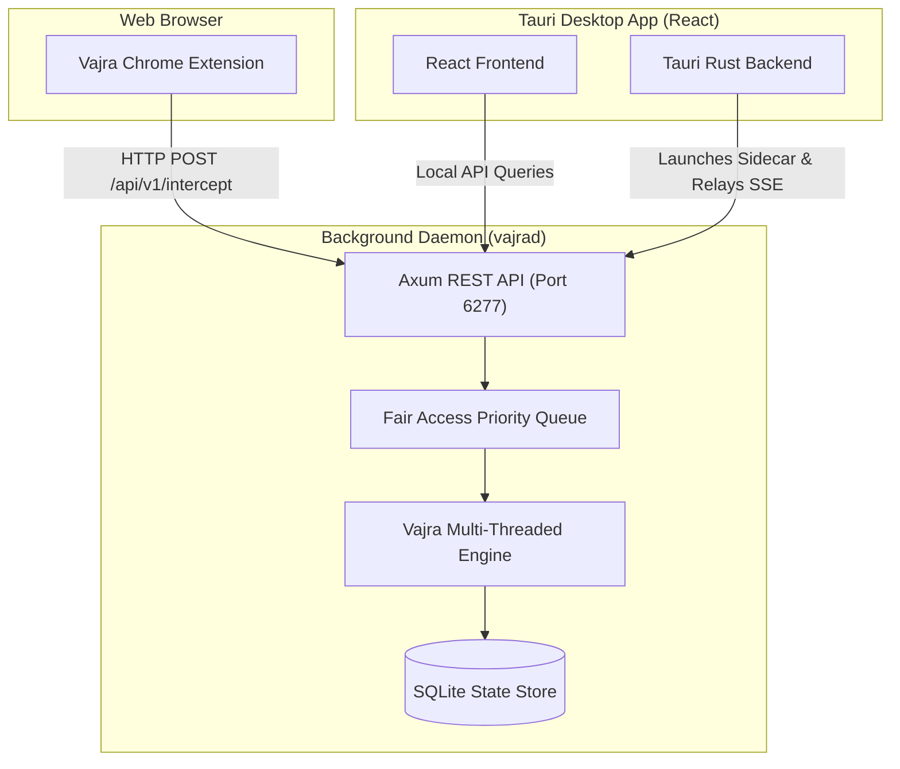

# ⚡ Vajra Download Manager

A high-performance, developer-first download manager. Headless-capable, API-driven, and built entirely in Rust + React.

---

## 🏗️ Architecture



---

## 📦 Workspace Crates

| Crate | Type | Purpose |
|-------|------|---------|
| `vajra-engine` | Library | Core download engine (HTTP/2, multi-segment, thread stealing, resume, retry, throttle). |
| `vajra-daemon` | Binary | REST API server, background job queue, WebDAV server, and SQLite storage (`vajrad`). |
| `vajra-protocol` | Library | Shared request/response types and `DaemonConfig` schemas. |
| `vajra-cli` | Binary | Clap-based terminal client (`vajra`). |
| `vajra-ui-tauri` | App | React + Tauri desktop GUI. |
| `vajra-extension` | Extension | Chrome/Edge Manifest V3 browser extension. |

> **Note:** The legacy `vajra-native-host` was removed in v0.4.1. The extension now connects purely via HTTP polling and auto-starts the app via the `vajra://` custom URL protocol.

---

## 🚀 Quick Start

### First-Time Setup (Build All)

Run the included build script to automatically configure and build the entire workspace:

```bat
build-all.bat
```

This single script:
1. Loads the MSVC environment on Windows.
2. Builds all Rust crates (`vajrad`, `vajra` CLI, Tauri backend).
3. Installs node modules and compiles the React frontends.
4. Packages the final installation artifacts.

**Prerequisites:**
- [Rust](https://rustup.rs) (`rustup install stable`)
- [Node.js 18+](https://nodejs.org)
- [VS Build Tools 2022](https://visualstudio.microsoft.com/downloads/#build-tools-for-visual-studio-2022) with "Desktop development with C++" workload enabled.

---

### Running Vajra

Start the application by running:

```bat
vajra.bat
```

The UI will boot up and **automatically launch the daemon** in the background — no separate terminal needed. Closing the UI window hides the app to the system tray. Right-click the tray icon and select **Quit** to exit completely.

> Running `vajra.bat` also registers the custom `vajra://` URL protocol handler in the Windows Registry, enabling the browser extension to auto-start the UI and daemon on demand.

### Browser Extension Setup

1. Open `chrome://extensions` (or `edge://extensions` for Microsoft Edge).
2. Enable **Developer Mode** in the top right.
3. Click **Load unpacked** in the top left.
4. Select the `vajra-extension/` directory (or build it first via `npm run build` inside `vajra-extension` and load `dist/`).
5. Open the Vajra extension popup. If Vajra isn't running, click **Launch Vajra** to auto-start the application.

---

## ⚙️ Engine Internals (`vajra-engine`)

### Multi-Segment Download Flow

1. **HEAD Probe**: Queries the URL to fetch `Content-Length`, `Accept-Ranges`, and `ETag`. Falls back gracefully to `GET` with a single byte range if HEAD is blocked.
2. **Auto-Categorize**: Scans file extensions and routes the download to designated folders (e.g., Videos, Music, Documents).
3. **OS-Level Space Allocation**: Pre-allocates contiguous space on the disk to prevent mid-download fragmentation or disk-full panics:
   - **Windows**: Uses `SetEndOfFile` + `SetFileValidData` (bypasses zero-filling for instant gigabyte allocation).
   - **Linux**: Uses `fallocate(2)`.
   - **macOS**: Uses `fcntl(F_PREALLOCATE)` + `ftruncate`.
4. **Byte-Range Multiplexing**: Splits the file size into concurrent segment downloads using HTTP `Range` requests (minimum chunk size of 1 MiB).
5. **Dynamic Thread Stealing**: When a worker finishes its chunk, it steals half of the largest remaining active segment from the slowest thread. No worker goes idle until the file is fully downloaded.
6. **Token-Bucket Throttling**: Limits connection speeds globally or on a per-download basis.
7. **Memory-Mapped Disk Writer**: Writes stream dataframes directly to mapped virtual memory-mapped positions via `MmapHandle`, falling back to standard sequential positional disk writing on failure.
8. **Transactional State Persistence**: Stores segment progress transactional metadata in a SQLite database (`download_segments`) for highly resilient resumes.

---

## 🔌 REST API Reference

Base URL: `http://127.0.0.1:6277/api/v1`

| Method | Endpoint | Description |
|--------|----------|-------------|
| `GET` | `/health` | Daemon health check |
| `GET` | `/downloads` | List all download records |
| `POST` | `/downloads` | Add new download (auto-categorized by default) |
| `GET` | `/downloads/:id` | Get details of a single download |
| `PATCH` | `/downloads/:id` | Pause / Resume / Cancel download task |
| `DELETE`| `/downloads/:id` | Remove download from history (optionally clean files) |
| `GET` | `/stats` | Global throughput and active queue stats |
| `GET` | `/config` | Read current DaemonConfig |
| `PATCH` | `/config` | Update category rules, speed limits, proxy, etc. |

### SSE (Server-Sent Events)

`GET /events` streams real-time newline-delimited JSON events for progress bars, emitted every 500ms.

---

## 📁 Configuration & Auto-Categorization

The daemon stores config in `%LOCALAPPDATA%/Vajra/config.json`. By default, downloads are automatically routed to the correct folder based on extension:

- **Videos** → `%USERPROFILE%\Videos`
- **Music** → `%USERPROFILE%\Music`
- **Documents** → `%USERPROFILE%\Documents`
- **Software / Archives** → `%USERPROFILE%\Downloads`

You can configure proxy settings, speed limits, max concurrent downloads, and post-queue actions (e.g., sleep/hibernate when done) via the settings UI or API.

---

## 🛠️ Troubleshooting

### `LNK1104: cannot open file 'msvcrt.lib'` during build
If you have a non-standard MSVC installation on Windows, the build may fail looking for the CRT libraries.
**Fix:** Add the `onecore` path to `.cargo/config.toml`:
```toml
[target.x86_64-pc-windows-msvc]
rustflags = ["-L", "C:\\Program Files\\Microsoft Visual Studio\\...\\lib\\onecore\\x64"]
```

### vswhom-sys build script fails
Some Tauri dependencies try to auto-detect Visual Studio and fail.
**Fix:** Run `cargo clean` and rebuild.

---

## 📖 Further Documentation

- [Architecture & Developer Guide](docs/ARCHITECTURE.md)
- [Changelog](docs/CHANGELOG.md)
